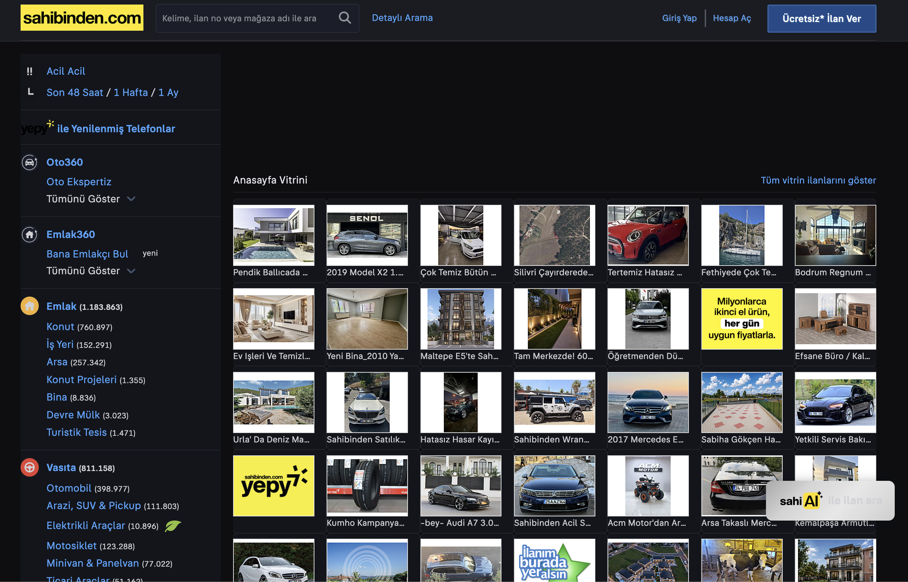

<p align="center">
  
</p>

<h1 align="center">🌙 Sarı Site Dark Mode</h1>

**Sahibinden.com** için özel olarak geliştirilmiş karanlık tema Chrome eklentisi. Göz yorgunluğunu azaltır, gece kullanımını konforlu hale getirir.

## ✨ Özellikler

- 🎨 **Kapsamlı Karanlık Tema** — Sahibinden.com'un tüm sayfalarına (arama, ilan detay, mesajlar, bana özel vb.) uyumlu
- 🔄 **Tek Tıkla Açma/Kapama** — Popup üzerinden anında geçiş
- 🧠 **Akıllı Renk Dönüşümü** — Inline style ve dinamik elementleri otomatik algılayarak karanlık temaya dönüştürür
- 🗺️ **Harita Desteği** — Google Maps görünümü invert filtresiyle karanlık hale gelir
- 📊 **Grafik Uyumluluğu** — Highcharts gibi grafik kütüphaneleri de desteklenir
- 🖼️ **Medya Koruması** — Görseller, videolar ve SVG'ler bozulmadan korunur
- 💬 **Mesajlaşma Desteği** — Yeni nesil mesajlaşma bileşenleri (efes-*) dahil tüm mesaj arayüzleri desteklenir
- ⚡ **MutationObserver** — Sayfadaki dinamik değişiklikleri gerçek zamanlı izleyerek tema tutarlılığını sağlar

## 📦 Kurulum

1. Bu projeyi bilgisayarınıza indirin:
   ```bash
   git clone https://github.com/LynXMaSTeR/SariSiteDarkMode.git
   ```
   veya **Code → Download ZIP** ile indirip çıkartın.

2. Chrome'da `chrome://extensions` adresine gidin.

3. Sağ üstteki **Geliştirici modu** anahtarını açın.

4. **Paketlenmemiş öğe yükle** butonuna tıklayın.

5. İndirdiğiniz proje klasörünü seçin.

6. Eklenti tarayıcı çubuğunda görünecektir. 🎉

## 🚀 Kullanım

1. Sahibinden.com'a gidin.
2. Tarayıcı çubuğundaki eklenti ikonuna tıklayın.
3. Açılan popup'taki toggle ile karanlık modu **açın** veya **kapatın**.
4. Tercih otomatik olarak kaydedilir; sayfa yenilemesi gerekmez.

## 📸 Ekran Görüntüsü



## 🛠️ Kullanılan Teknolojiler

| Teknoloji | Açıklama |
|-----------|----------|
| **Chrome Extensions API (Manifest V3)** | Eklenti altyapısı |
| **JavaScript (Vanilla)** | Content script & popup mantığı |
| **CSS** | Kapsamlı karanlık tema stilleri |
| **Chrome Storage API** | Kullanıcı tercihini kaydetme |
| **MutationObserver API** | Dinamik DOM değişikliklerini izleme |

## 📁 Proje Yapısı

```
SariSiteDarkMode/
├── manifest.json        # Eklenti yapılandırması
├── content.js           # Sayfaya enjekte edilen ana script
├── popup.html           # Popup arayüzü
├── popup.js             # Popup mantığı
├── logo.png             # Eklenti ikonu
└── styles/
    └── sahibinden.css   # Karanlık tema CSS kuralları (~1300 satır)
```

## 👨‍💻 Geliştirici

**LynXMaSTeR**

## 📄 Lisans

Bu proje [MIT Lisansı](LICENSE) ile lisanslanmıştır.
